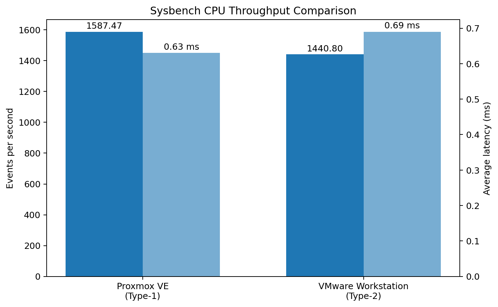

# Performance Analysis of Type-1 and Type-2 Hypervisors

## Proxmox VE vs VMware Workstation

This repository contains the laboratory work for analyzing the performance of a **Type-1 hypervisor** and a **Type-2 hypervisor** using an identically configured Ubuntu virtual machine and the **Sysbench CPU benchmark**.

The experiment was divided into two independent parts:

- **Part 1 – Type-1 Hypervisor:** Proxmox VE
- **Part 2 – Type-2 Hypervisor:** VMware Workstation
- **Guest OS:** Ubuntu 22.04.5 LTS
- **CPU allocation:** 2 vCPU
- **Memory allocation:** 2 GB
- **Virtual disk:** 20 GB
- **CPU benchmark:** `sysbench cpu --cpu-max-prime=20000 run`

> **Note:** The benchmark values below are the measurements recorded in the supplied Type-1 and Type-2 experiment documents. They represent the particular experimental runs and should not be treated as universal performance characteristics of all Type-1 or Type-2 hypervisors.

---

# Part 1 – Type-1 Hypervisor: Proxmox VE

## 1. Aim

To create and verify a virtual machine on the Proxmox VE Type-1 hypervisor, inspect its CPU, memory and disk configuration, monitor resource utilization, and measure CPU performance using Sysbench.

## 2. Type-1 Architecture

```text
Physical Hardware
       ↓
   Proxmox VE
       ↓
      KVM
       ↓
Ubuntu 22.04.5 LTS VM
```

Proxmox VE was used with KVM virtualization. The Ubuntu guest was presented with virtual CPU, memory, storage and networking resources.

## 3. Experimental Configuration

| Parameter | Configuration / Observed Value |
|---|---|
| Hypervisor | Proxmox VE (Type-1) |
| Guest OS | Ubuntu 22.04.5 LTS |
| CPU allocation | 1 socket, 2 cores = 2 vCPU |
| CPU model | QEMU Virtual CPU version 2.5+ |
| Memory | 2048 MiB (2 GB) |
| Virtual disk | 20 GB |
| Network | `vmbr0` bridge |
| Virtualization | KVM |

## 4. Type-1 Execution Procedure

### Step 1 – Access Proxmox VE

Open the Proxmox VE web interface and sign in with the assigned credentials.

### Step 2 – Create the VM

Use the **Create VM** wizard and configure:

- Ubuntu as the guest operating system
- 2 vCPU
- 2 GB RAM
- 20 GB virtual disk

### Step 3 – Configure Networking

Attach the VM to the `vmbr0` network bridge using the configured/default virtual network model.

### Step 4 – Install Ubuntu

Start the VM from the Proxmox console, install Ubuntu 22.04.5 LTS, restart the VM and log in.

### Step 5 – Verify the VM

Run the Linux system-information commands described in the **Commands Used** section below.

### Step 6 – Monitor Resources

Use `top` inside Ubuntu to observe CPU utilization, memory utilization, processes and load average.

The Proxmox VE management interface was also used to observe:

- CPU usage
- Memory usage
- Network traffic
- Disk I/O

### Step 7 – Install Sysbench

Update the Ubuntu package repository and install Sysbench.

### Step 8 – Run the CPU Benchmark

Execute:

```bash
sysbench cpu --cpu-max-prime=20000 run
```

Record execution time, total events, events per second and latency statistics.

### Step 9 – Shut Down the VM

After completing the measurements:

```bash
sudo poweroff
```

## 5. Type-1 Commands and Their Purpose

### `hostnamectl`

```bash
hostnamectl
```

Displays system identification information such as hostname, operating system, kernel and architecture.

### `lscpu`

```bash
lscpu
```

Displays CPU architecture and processor information, including the number of CPUs/cores and virtualization-related information reported by the guest.

### `free -h`

```bash
free -h
```

Displays RAM and swap usage in human-readable units.

### `df -h`

```bash
df -h
```

Displays filesystem disk usage in human-readable units. This was used to verify the virtual filesystem available to the Ubuntu guest.

### `top`

```bash
top
```

Provides live information about CPU utilization, memory utilization, processes and system load.

Press `q` to exit `top`.

### `sudo apt update`

```bash
sudo apt update
```

Updates the local package index so Ubuntu can obtain the latest available package information.

### `sudo apt install sysbench -y`

```bash
sudo apt install sysbench -y
```

Installs Sysbench. The `-y` option automatically confirms the installation prompt.

### `sysbench --version`

```bash
sysbench --version
```

Displays the installed Sysbench version and verifies that Sysbench is available.

### Sysbench CPU Benchmark

```bash
sysbench cpu --cpu-max-prime=20000 run
```

Runs Sysbench's CPU workload using a maximum prime value of `20000`. The output provides execution time, total events, events per second and latency measurements.

### `sudo poweroff`

```bash
sudo poweroff
```

Shuts down the Ubuntu virtual machine.

## 6. Type-1 Results

| Metric | Proxmox VE |
|---|---:|
| Hypervisor | Proxmox VE |
| Type | Type-1 |
| Guest OS | Ubuntu 22.04.5 LTS |
| CPU | 2 vCPU |
| Memory | 2 GB |
| Disk | 20 GB |
| Execution time | 10.0005 s |
| Total events | 15,877 |
| Events/sec | 1,587.47 |
| Minimum latency | 0.59 ms |
| Average latency | 0.63 ms |
| Maximum latency | 1.34 ms |

### Type-1 Resource Observations

The supplied experiment recorded approximately 1.9 GiB of guest-visible memory from `free -h`, while the Proxmox VM was configured with 2.00 GiB. The Proxmox monitoring graphs showed CPU activity, memory usage rising to roughly 1.8 GiB, network activity including a transient spike, and disk read/write activity.

---

# Part 2 – Type-2 Hypervisor: VMware Workstation

## 7. Aim

To create and verify a virtual machine on VMware Workstation, inspect its CPU, memory and disk configuration, monitor resource utilization, and measure CPU performance using Sysbench.

## 8. Type-2 Architecture

```text
Physical Hardware
       ↓
Host Operating System
       ↓
VMware Workstation
       ↓
Ubuntu 22.04.5 LTS VM
```

VMware Workstation operates above the host operating system. The guest's virtual CPU, memory, storage and networking resources are therefore mediated through the virtualization software and host OS.

## 9. Experimental Configuration

| Parameter | Configuration / Observed Value |
|---|---|
| Hypervisor | VMware Workstation (Type-2) |
| Guest OS | Ubuntu 22.04.5 LTS |
| CPU allocation | 1 processor, 2 cores = 2 vCPU |
| CPU model | 13th Gen Intel Core i5-13450HX presented to guest |
| Memory | 2048 MB (approximately 2 GB) |
| Virtual disk | 20 GB |
| Network | NAT |
| Virtualization | VMware / full virtualization |

## 10. Type-2 Execution Procedure

### Step 1 – Launch VMware Workstation

Open VMware Workstation and select **Create a New Virtual Machine**.

### Step 2 – Create the VM

Choose the typical configuration and select the Ubuntu ISO image.

### Step 3 – Configure Virtual Hardware

Configure:

- 2 vCPU
- 2 GB RAM
- 20 GB virtual disk
- NAT networking

### Step 4 – Install Ubuntu

Power on the VM, install Ubuntu 22.04.5 LTS, restart and log in.

### Step 5 – Verify the VM

Use `hostnamectl`, `lscpu`, `free -h` and `df -h` to inspect the guest configuration.

### Step 6 – Monitor Resources

Run:

```bash
top
```

to observe CPU utilization, memory utilization, processes and load average.

### Step 7 – Install Sysbench

Update the package repository and install Sysbench using the commands described below.

### Step 8 – Run the CPU Benchmark

Execute:

```bash
sysbench cpu --cpu-max-prime=20000 run
```

Record execution time, total events, events per second and latency statistics.

### Step 9 – Shut Down the VM

After completing the measurements:

```bash
sudo poweroff
```

## 11. Type-2 Commands and Their Purpose

The same guest-side commands were used so that the Type-1 and Type-2 measurements could be inspected using a consistent procedure.

### `hostnamectl`

```bash
hostnamectl
```

Displays the hostname, Ubuntu operating system, kernel and architecture information.

### `lscpu`

```bash
lscpu
```

Displays CPU architecture, CPU/core information and the processor/virtualization information presented to the guest.

### `free -h`

```bash
free -h
```

Displays memory and swap allocation and usage in human-readable units.

### `df -h`

```bash
df -h
```

Displays filesystem capacity, used space and available space.

### `top`

```bash
top
```

Provides live CPU, memory, process and load information inside the Ubuntu guest.

Press `q` to exit.

### `sudo apt update`

```bash
sudo apt update
```

Updates the Ubuntu package index.

### `sudo apt install sysbench -y`

```bash
sudo apt install sysbench -y
```

Installs Sysbench without requiring interactive confirmation.

### `sysbench --version`

```bash
sysbench --version
```

Verifies the installed Sysbench version.

### Sysbench CPU Benchmark

```bash
sysbench cpu --cpu-max-prime=20000 run
```

Runs the CPU benchmark with the same `--cpu-max-prime=20000` workload used in the Type-1 experiment.

### `sudo poweroff`

```bash
sudo poweroff
```

Shuts down the Ubuntu virtual machine.

## 12. Type-2 Results

| Metric | VMware Workstation |
|---|---:|
| Hypervisor | VMware Workstation |
| Type | Type-2 |
| Guest OS | Ubuntu 22.04.5 LTS |
| CPU | 2 vCPU |
| Memory | 2 GB |
| Disk | 20 GB |
| Execution time | 10.0004 s |
| Total events | 14,410 |
| Events/sec | 1,440.80 |
| Minimum latency | 0.65 ms |
| Average latency | 0.69 ms |
| Maximum latency | 1.89 ms |

### Type-2 Resource Observations

The guest reported 2 online CPUs and approximately 2 GB of allocated memory. The supplied `free -h` output showed approximately 1.9 GiB total memory, with about 865 MiB available at the captured instant. The `df -h` output showed a 20 GB virtual root filesystem, with approximately 12 GB used and 6.5 GB available.

---

# Part 3 – Performance Comparison

## 13. Benchmark Comparison

| Metric | Proxmox VE (Type-1) | VMware Workstation (Type-2) |
|---|---:|---:|
| Execution time | 10.0005 s | 10.0004 s |
| Total events | 15,877 | 14,410 |
| Events/sec | 1,587.47 | 1,440.80 |
| Minimum latency | 0.59 ms | 0.65 ms |
| Average latency | 0.63 ms | 0.69 ms |
| Maximum latency | 1.34 ms | 1.89 ms |

## 14. Graphical Comparison

The following graph summarizes the supplied Sysbench throughput and average-latency measurements.



> **If the image is stored elsewhere in the repository, replace the path above with the appropriate relative path.**

For example:

```text
hypervisor-performance-analysis/
├── README.md
└── graphs/
    └── hypervisor-benchmark-comparison.png
```

Then use:

```markdown

```

## 15. Interpretation of the Supplied Results

The Proxmox VE run recorded **1,587.47 events/sec**, while the VMware Workstation run recorded **1,440.80 events/sec**.

The recorded average latency was:

- **Proxmox VE:** 0.63 ms
- **VMware Workstation:** 0.69 ms

The recorded execution times were almost identical:

- **Proxmox VE:** 10.0005 s
- **VMware Workstation:** 10.0004 s

Therefore, in this particular experimental run, the measured Sysbench throughput and latency values differed even though the total execution times were nearly the same. These results should be interpreted as measurements from the supplied setup rather than as universal characteristics of Type-1 and Type-2 virtualization.

Factors such as host workload, resource contention, virtualization overhead and VM configuration can affect benchmark measurements.

---

# Part 4 – Key Observations

1. Both experiments used Ubuntu 22.04.5 LTS.
2. Both VMs were configured with 2 vCPU, 2 GB RAM and a 20 GB virtual disk.
3. The Type-1 experiment used Proxmox VE with KVM virtualization.
4. The Type-2 experiment used VMware Workstation above the host operating system.
5. `hostnamectl`, `lscpu`, `free -h` and `df -h` were used for guest-system verification.
6. `top` was used for live resource monitoring.
7. Sysbench was used to run a repeatable CPU workload with `--cpu-max-prime=20000`.
8. The supplied Proxmox VE result was 1,587.47 events/sec.
9. The supplied VMware Workstation result was 1,440.80 events/sec.
10. The measured average latencies were 0.63 ms for Proxmox VE and 0.69 ms for VMware Workstation.
11. The two measured execution times were almost identical.
12. Benchmark results can be influenced by virtualization overhead, host workload, resource contention and VM configuration.

---

# Part 5 – Repository Structure

A suggested repository structure is:

```text
hypervisor-performance-analysis/
│
├── README.md
│
├── graphs/
│   └── hypervisor-benchmark-comparison.png
│
├── Type-1/
│   └── Type-1.docx
│
├── Type-2/
│   └── Type-2.docx
│
└── Lab-Manual/
    └── Lab-Manual-Hypervisor-Performance-Analysis.docx
```

---

# Part 6 – References

- Proxmox VE – Type-1 hypervisor experiment documentation
- VMware Workstation – Type-2 hypervisor experiment documentation
- Performance Analysis of Type-1 and Type-2 Hypervisors – Lab Manual
- Sysbench CPU benchmark

---

# Student Information

| Field | Details |
|---|---|
| Name | Hrishikesh Patil |
| USN | 01FE24BCI043 |
| Roll No. | 109 |
| Division | A1 |
