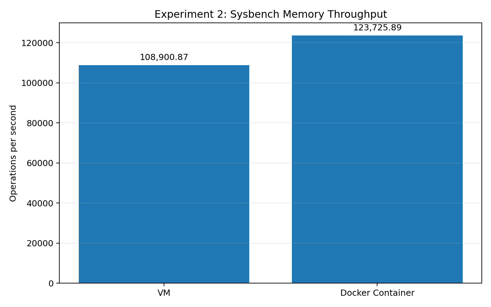

# Performance Analysis of Virtual Machines and Containers

This repository contains the documentation and results for two performance experiments using **Sysbench** in virtualized and containerized environments.

- **Experiment 1 — CPU Performance**
- **Experiment 2 — Memory Performance**

The experiments are kept as separate sections so that the execution procedure, commands, results, observations, and conclusions for each workload remain clear.

---

# Experiment 1 — CPU Performance

## 1. Objective

To measure CPU performance using Sysbench and compare workload behavior across different thread counts in a controlled Ubuntu virtual-machine environment.

The specified workload uses:

- Prime limit: `20,000`
- Benchmark duration: `30 seconds`
- Thread counts: `1`, `2`, `4`, and `8`
- Main metrics: events/sec and execution time
- Additional metrics: latency statistics

---

## 2. Experimental Environment

| Component | Observed / Configured Value |
|---|---|
| Virtualization environment | Ubuntu running inside VMware Workstation |
| Guest OS | Ubuntu 24.04 |
| CPU allocation | 4 CPUs / 4 threads available |
| `nproc` | 4 |
| Memory | 7.7 GiB total |
| Sysbench | 1.0.20 |
| Python | 3.12.3 |
| fio | fio-3.36 |
| iperf3 | 3.16 |

---

## 3. Principle of the CPU Benchmark

Sysbench's CPU benchmark repeatedly performs prime-number calculations.

The benchmark reports:

- **Events per second** — CPU workload throughput.
- **Total events** — Number of completed benchmark events.
- **Execution time** — Total duration of the benchmark.
- **Latency** — Time associated with individual benchmark events.

A higher events-per-second value means more benchmark events were completed during the measured period.

The experiment varies the thread count to observe CPU scalability. Repeated runs are recommended when performing a complete statistical analysis.

---

## 4. CPU Benchmark Execution

The benchmark was executed using:

```bash
sysbench cpu \
  --cpu-max-prime=20000 \
  --threads=<THREADS> \
  --time=30 \
  run
```

The `<THREADS>` value is changed for each test.

### Required thread configurations

```text
1 thread
2 threads
4 threads
8 threads
```

The prime limit and duration remain unchanged for every run.

---

## 5. Commands Used and Their Purpose

### `sysbench --version`

```bash
sysbench --version
```

Verifies that Sysbench is installed and displays its installed version. The supplied environment reports **Sysbench 1.0.20**.

### CPU benchmark command

```bash
sysbench cpu --cpu-max-prime=20000 --threads=<THREADS> --time=30 run
```

Runs the CPU benchmark.

| Option | Purpose |
|---|---|
| `cpu` | Selects Sysbench's CPU benchmark. |
| `--cpu-max-prime=20000` | Sets the maximum prime number used by the workload. |
| `--threads=<THREADS>` | Sets the number of worker threads. |
| `--time=30` | Runs the benchmark for 30 seconds. |
| `run` | Starts the benchmark. |

---

## 6. CPU Experimental Procedure

1. Open the Ubuntu terminal in the VM.
2. Verify that Sysbench is installed.
3. Run the CPU benchmark with a prime limit of 20,000.
4. Set the benchmark duration to 30 seconds.
5. Run the test for 1 thread.
6. Repeat for 2, 4 and 8 threads.
7. Record events/sec, total events, execution time and latency statistics.
8. Use the same workload parameters when the corresponding container benchmark is executed.

---

## 7. Recorded CPU Results

Only values visibly available in the supplied experiment evidence are included. Missing values are not estimated.

| Threads | Events/sec | Total Events | Total Time | Avg Latency | 95th Percentile | Max Latency |
|---:|---:|---:|---:|---:|---:|---:|
| 1 | 1,775.78 | 53,275 | 30.0001 s | — | — | — |
| 2 | Not captured | Not captured | Not captured | Not captured | Not captured | Not captured |
| 4 | 6,948.89 | 208,476 | 30.0005 s | 0.58 ms | 0.60 ms | 28.63 ms |
| 8 | Not captured | Not captured | Not captured | Not captured | Not captured | Not captured |

### Additional 4-thread Run

A second supplied 4-thread capture records:

| Metric | Additional 4-thread Run |
|---|---:|
| Total events | 208,028 |
| Execution time | 30.0003 s |
| Average latency | 0.58 ms |
| 95th-percentile latency | 0.61 ms |
| Maximum latency | 6.39 ms |

This second 4-thread run is retained as a separate observation and is not merged with the first 4-thread result.

---

## 8. CPU Throughput Graph

The graph below uses only the completed benchmark values available in the supplied experiment.


If the graph is stored in a `graphs/` directory, use:

```markdown

```

The graph intentionally does not include 2-thread or 8-thread values because their final benchmark outputs were not supplied.

---

## 9. CPU Observations

- The 1-thread run recorded **1,775.78 events/sec**.
- The 4-thread run recorded **6,948.89 events/sec**.
- The 4-thread run completed **208,476 events** in **30.0005 seconds**.
- The 4-thread run reported an average latency of **0.58 ms**.
- The 4-thread run reported a 95th-percentile latency of **0.60 ms**.
- The maximum latency in the first 4-thread run was **28.63 ms**.
- A second 4-thread run was captured separately.
- The 2-thread and final 8-thread results are not visible in the supplied evidence.

---

## 10. CPU Result

The CPU benchmark was successfully executed in the Ubuntu VM using Sysbench.

For the completed measurements, recorded throughput increased from **1,775.78 events/sec at 1 thread** to **6,948.89 events/sec at 4 threads**.

A complete 1/2/4/8-thread scalability analysis requires the missing final outputs for 2 and 8 threads.

---

## 11. CPU Conclusion

Experiment 1 demonstrates CPU benchmarking using Sysbench with a fixed prime-calculation workload and different worker-thread counts.

The supplied evidence confirms completed 1-thread and 4-thread measurements. The 4-thread measurement recorded higher throughput than the 1-thread measurement. No values are inferred for the missing 2-thread and 8-thread outputs.

---

## 12. CPU Evidence / Screenshot Placeholders

Replace the following paths with the actual screenshots from the experiment:

```markdown

```

```markdown

```

```markdown

```

```markdown

```

```markdown

```

---

## 13. CPU Benchmark Command Reference

### General scalability command

```bash
sysbench cpu \
  --cpu-max-prime=20000 \
  --threads=<THREADS> \
  --time=30 \
  run
```

### Example — 1 thread

```bash
sysbench cpu \
  --cpu-max-prime=20000 \
  --threads=1 \
  --time=30 \
  run
```

### Example — 4 threads

```bash
sysbench cpu \
  --cpu-max-prime=20000 \
  --threads=4 \
  --time=30 \
  run
```

### Example — 8 threads

```bash
sysbench cpu \
  --cpu-max-prime=20000 \
  --threads=8 \
  --time=30 \
  run
```

---

# Experiment 2 — Memory Performance

## 14. Objective

To measure memory-operation performance using Sysbench and compare the same controlled workload between a **Virtual Machine (VM)** and a **Docker Container**.

The supplied execution evidence contains one captured VM run and one captured Docker Container run. The lab manual specifies repeated measurements, but the supplied screenshots do not contain the complete set of ten repetitions. Therefore, this README reports the captured runs without claiming a ten-run statistical average.

---

## 15. Experimental Parameters

| Parameter | Configuration |
|---|---|
| Tool | Sysbench 1.0.20 |
| Workload | Memory operations |
| Memory block size | 1M |
| Total memory size | 10G |
| Threads | 4 |
| Operation | Write |
| Main metrics | Operations/sec and latency |
| Environments | VM and Docker Container |

---

## 16. Principle of the Memory Benchmark

The Sysbench memory benchmark performs repeated memory operations using the configured block size and total memory size.

For this experiment:

```text
Block size  = 1 MiB
Total size  = 10 GiB
Threads     = 4
Operation   = Write
```

The main measurements are:

- **Operations/sec** — memory-operation throughput.
- **Transfer rate** — amount of data transferred per second.
- **Total time** — time taken for the captured workload.
- **Average latency** — average latency of memory operations.
- **Maximum latency** — highest observed latency.
- **95th percentile latency** — latency value below which 95% of measured operations fall.

The same workload is executed in the VM and Docker Container.

---

## 17. VM Memory Benchmark Execution

The VM benchmark uses:

```bash
sysbench memory \
  --memory-block-size=1M \
  --memory-total-size=10G \
  --threads=4 \
  run
```

### VM Procedure

1. Open the Ubuntu terminal in the VM.
2. Verify that Sysbench is installed.
3. Configure a 1 MiB memory block size.
4. Set the total memory workload to 10 GiB.
5. Use 4 worker threads.
6. Execute the memory benchmark.
7. Record operations/sec, transfer rate, execution time and latency.
8. Repeat the benchmark as specified by the lab manual when performing the full experiment.

The manual specifies storing VM results under:

```text
results/raw/memory/vm
```

---

## 18. Docker Container Memory Benchmark Execution

The same Sysbench workload is executed through the supplied:

```text
vm-container-benchmark
```

container image.

The Docker benchmark uses the same parameters:

```text
Memory block size = 1 MiB
Total memory size = 10 GiB
Threads           = 4
Operation         = Write
```

The manual specifies storing container results under:

```text
results/raw/memory/container
```

### Docker Procedure

1. Start or access the `vm-container-benchmark` environment.
2. Verify that the Sysbench memory benchmark is available.
3. Use the same block size, total memory size and thread count as the VM.
4. Execute the memory benchmark.
5. Record operations/sec, transfer rate, execution time and latency.
6. Repeat the benchmark according to the lab manual when collecting the complete dataset.

---

## 19. Memory Commands Used and Their Purpose

### Sysbench version

```bash
sysbench --version
```

Displays the installed Sysbench version and verifies that Sysbench is available. The supplied experiment uses **Sysbench 1.0.20**.

### Memory benchmark

```bash
sysbench memory \
  --memory-block-size=1M \
  --memory-total-size=10G \
  --threads=4 \
  run
```

| Option | Purpose |
|---|---|
| `memory` | Selects the Sysbench memory benchmark. |
| `--memory-block-size=1M` | Sets the memory operation block size to 1 MiB. |
| `--memory-total-size=10G` | Sets the total memory workload to 10 GiB. |
| `--threads=4` | Uses four worker threads. |
| `run` | Starts the benchmark. |

---

## 20. VM Memory Result

The supplied VM screenshot records:

| Metric | VM Result |
|---|---:|
| Total operations | 10,240 |
| Operations/sec | 108,900.87 |
| Transferred | 10,240.00 MiB |
| Transfer rate | 108,900.87 MiB/sec |
| Total time | 0.0931 s |
| Average latency | 0.03 ms |
| Maximum latency | 3.04 ms |
| 95th percentile | 0.03 ms |
| Latency sum | 341.60 ms |
| Events/thread average | 2560.0000 |
| Events/thread standard deviation | 0.00 |
| Execution-time average | 0.0854 s |
| Execution-time standard deviation | 0.01 s |

---

## 21. Docker Container Memory Result

The supplied Docker Container screenshot records:

| Metric | Container Result |
|---|---:|
| Total operations | 10,240 |
| Operations/sec | 123,725.89 |
| Transferred | 10,240.00 MiB |
| Transfer rate | 123,725.89 MiB/sec |
| Total time | 0.0819 s |
| Average latency | 0.03 ms |
| Maximum latency | 1.13 ms |
| 95th percentile | 0.03 ms |
| Latency sum | 312.08 ms |
| Events/thread average | 2560.0000 |
| Events/thread standard deviation | 0.00 |
| Execution-time average | 0.0780 s |
| Execution-time standard deviation | 0.00 s |

---

## 22. VM vs Docker Container Comparison

| Metric | VM | Docker Container |
|---|---:|---:|
| Operations/sec | 108,900.87 | 123,725.89 |
| Transfer rate | 108,900.87 MiB/sec | 123,725.89 MiB/sec |
| Total time | 0.0931 s | 0.0819 s |
| Average latency | 0.03 ms | 0.03 ms |
| Maximum latency | 3.04 ms | 1.13 ms |
| 95th percentile | 0.03 ms | 0.03 ms |
| Latency sum | 341.60 ms | 312.08 ms |

---

## 23. Memory Throughput Graph

The graph below visualizes the captured operations/sec values from the VM and Docker Container runs.



If the graph is stored in a `graphs/` directory, use:

```markdown

```

---

## 24. Maximum Latency Comparison

The supplied results also provide the following maximum-latency measurements:

| Environment | Maximum Latency |
|---|---:|
| VM | 3.04 ms |
| Docker Container | 1.13 ms |

Both captured runs report an average latency of **0.03 ms**.

Optional graph placeholder:

```markdown

```

---

## 25. Memory Observations

1. Both runs use the same benchmark structure: Sysbench 1.0.20, 4 threads, 1 MiB block size, 10 GiB total size and Write operation.
2. The VM run records **108,900.87 operations/sec**.
3. The Docker Container run records **123,725.89 operations/sec**.
4. Both runs report an average latency of **0.03 ms**.
5. The maximum latency visible in the VM result is **3.04 ms**.
6. The maximum latency visible in the Docker Container result is **1.13 ms**.
7. The captured container run has a higher recorded transfer rate than the captured VM run.
8. The supplied screenshots represent individual captured runs rather than the complete ten repetitions specified by the lab manual.

---

## 26. Memory Result

The memory benchmark was successfully executed in both the VM and Docker Container environments using the controlled Sysbench workload.

The captured results are:

```text
VM:
108,900.87 MiB/sec

Docker Container:
123,725.89 MiB/sec
```

The VM recorded a total time of **0.0931 seconds**, while the Docker Container recorded **0.0819 seconds**.

Both captured runs reported an average latency of **0.03 ms**.

---

## 27. Memory Conclusion

Experiment 2 demonstrates the use of Sysbench to measure memory-operation throughput and latency in a VM and a Docker Container.

For the two supplied captured runs, the Docker Container result records a higher transfer rate and a lower maximum latency than the VM result.

These are observations from the supplied execution evidence. The lab manual calls for repeated measurements, and the supplied screenshots do not contain all ten repetitions. Therefore, the individual captured values should not be treated as a statistically robust overall comparison.

---

## 28. Memory Evidence / Screenshot Placeholders

Replace the following paths with the actual screenshots from the experiment:

```markdown

```

```markdown

```

---

## 29. Memory Benchmark Command Reference

### VM

```bash
sysbench memory \
  --memory-block-size=1M \
  --memory-total-size=10G \
  --threads=4 \
  run
```

### Container

Run the same Sysbench workload through the supplied `vm-container-benchmark` image/environment:

```text
Memory block size = 1M
Total memory size = 10G
Threads = 4
Operation = Write
```

The important requirement is that the VM and container use the same workload parameters.

---

# Repository Structure

```text
virtual-machines-vs-containers/
│
├── README.md
│
├── graphs/
│   ├── experiment-1-cpu-throughput.png
│   └── experiment-2-memory-throughput.png
│
├── Experiment-1/
│   └── CPU-Performance/
│
└── Experiment-2/
    └── Memory-Performance/
```

---

# References

- Supplied **Experiment 1 — CPU Performance** document
- Supplied **Experiment 2 — Memory Performance** document
- Supplied lab manual / experimental instructions
- Sysbench benchmark

---

# Student Information

| Field | Details |
|---|---|
| Student Name | Hrishikesh Patil |
| USN | 01FE24BCI043 |
| Course / Lab | Performance Analysis of Virtual Machines and Containers |
| Experiments | Experiment 1 — CPU Performance; Experiment 2 — Memory Performance |
